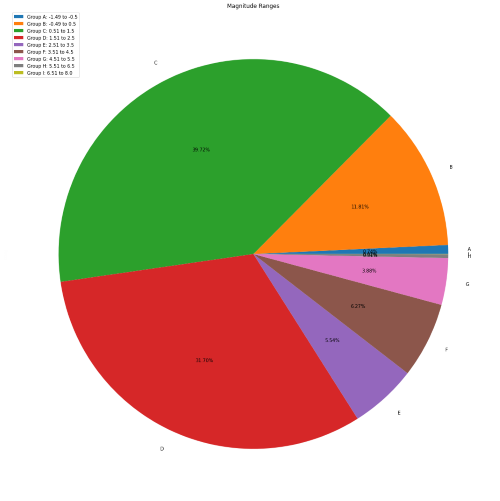

### Fun and Games with Python

[Dice Rolling Simulator](dice.html)  

---
[Guess the Number Game](guessnumber.html)  

---
[Mad Libs Generator](madlibs.html)  

---
[Text Based Adventure Game](textadventure.html)

---

### Data Management, Manipulation & Modelling in Python 

[Earthquake Data Visualisation](earthquake.html)  

---
[JFK Flight Delay Analysis with Linear Regression](jfk.html)  

| TAIL_NUM | DEST | DEP_DELAY | CRS_ELAPSED_TIME| TAXI_OUT |
|----------|------|-----------|-----------------|----------|
| N828JB   | CHS  | -1        | 124             | 14       |
| N992JB   | LAX  | -7        | 371             | 15       |
| N959JB   | FLL  | 40        | 181             | 22       |
| N999JQ   | MCO  | -2        | 168             | 12       |
| N880DN   | ATL  | -4        | 139             | 13       |

---
### Machine Learning in Python

[Titanic Survival Analysis with Logistic Regression](titanic.html)  

---

[Heart Disease Classification with Neural Networks](heartml.html)  

---

[Fake News Prediction with Supervised Machine Learning](fakenews.html)  

---

[Charity Geolocation Analysis with Unsupervised Machine Learning](charity.html)  

---